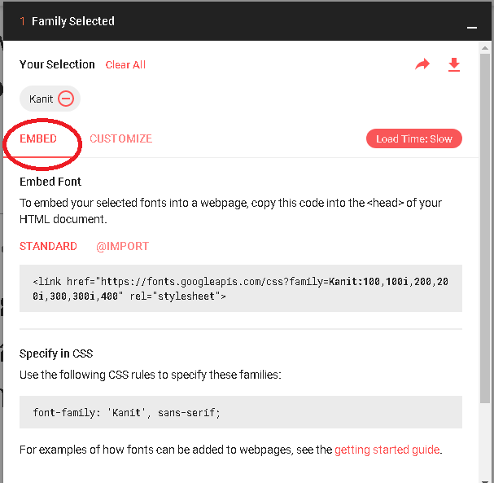

# About
This document shows coding examples to use Google API support Thai fonts on web. All these fonts are free and open source. You can use them in any non-commercial or commercial project. ([read more](https://developers.google.com/fonts/))


## 1. Athiti Font
```html
<html>
  <head>  	
    <link href="https://fonts.googleapis.com/css?family=Athiti" rel="stylesheet">
    <style>
      body {
		font-family: 'Athiti', sans-serif;
                font-size: 48px;
      }
    </style>
  </head>
  <body>
	<div>ฟอนต์ Athiti</div>
        <div>ฉันเฝ้าดูพายุ มันทั้งสวยงามและน่ากลัว</div>
  </body>
</html>
```
__display__


## 2. Chonburi Font
```html
<html>
  <head>
    <link href="https://fonts.googleapis.com/css?family=Chonburi" rel="stylesheet">
    <style>
      body {
		font-family: 'Chonburi', cursive;
                font-size: 48px;
      }
    </style>
  </head>
  <body>
	<div>ฟอนต์ Chonburi</div>
        <div>ภาพตรงหน้าเราช่างงดงามจริงๆ</div>
  </body>
</html>
```
__display__


## 3. Itim Font
```html
<html>
  <head>
    <link href="https://fonts.googleapis.com/css?family=Itim" rel="stylesheet">
    <style>
      body {
		font-family: 'Itim', cursive;
                font-size: 48px;
      }
    </style>
  </head>
  <body>
	<div>ฟอนต์ Itim</div>
        <div>แล้วคืนแห่งดาวตกดวงแรกก็มาถึง</div>
  </body>
</html>
```
__display__


## 4. Kanit Font
```html
<html>
  <head>	
    <link href="https://fonts.googleapis.com/css?family=Kanit" rel="stylesheet">
    <style>
      body {
		font-family: 'Kanit', sans-serif;
                font-size: 48px;
      }
    </style>
  </head>
  <body>
	<div>ฟอนต์ Kanit</div>
        <div>เสียงที่บันทึกไว้ดังมาจากลำโพงเหนือประตู</div>
  </body>
</html>
```
__display__


## 5. Maitree Font
```html
<html>
  <head>  	
    <link href="https://fonts.googleapis.com/css?family=Maitree" rel="stylesheet">
    <style>
      body {
		font-family: 'Maitree', serif;
                font-size: 48px;
      }
    </style>
  </head>
  <body>
	<div>ฟอนต์ Maitree</div>
        <div>ดวงจันทร์ซ่อนหน้าอยู่ในเงามืด</div>
  </body>
</html>
```
__display__


## 6. Mitr Font
```html
<html>
  <head>	
    <link href="https://fonts.googleapis.com/css?family=Mitr" rel="stylesheet">
    <style>
      body {
		font-family: 'Mitr', sans-serif;
                font-size: 48px;
      }
    </style>
  </head>
  <body>
	<div>ฟอนต์ Mitr</div>
        <div>ขอบหยักของปีกแลดูเด่นชัดกลางแสงเรืองรองสีแดง</div>
  </body>
</html>
```
__display__


## 7. Pattaya Font
```html
<html>
  <head>	
    <link href="https://fonts.googleapis.com/css?family=Pattaya" rel="stylesheet">
    <style>
      body {
		font-family: 'Pattaya', sans-serif;
                font-size: 48px;
      }
    </style>
  </head>
  <body>
	<div>ฟอนต์ Pattaya</div>
        <div>ท้องฟ้าไร้เมฆและเป็นสีน้ำเงินเข้มจัด</div>
  </body>
</html>
```
__display__


## 8. Pridi Font
```html
<html>
  <head>	
    <link href="https://fonts.googleapis.com/css?family=Pridi" rel="stylesheet">
    <style>
      body {
		font-family: 'Pridi', serif;
                font-size: 48px;
      }
    </style>
  </head>
  <body>
	<div>ฟอนต์ Pridi</div>
        <div>เสียงที่บันทึกไว้ดังมาจากลำโพงเหนือประตู</div>
  </body>
</html>
```
__display__


## 9. Prompt Font
```html
<html>
  <head>	
    <link href="https://fonts.googleapis.com/css?family=Prompt" rel="stylesheet">
    <style>
      body {
		font-family: 'Prompt', sans-serif;
                font-size: 48px;
      }
    </style>
  </head>
  <body>
	<div>ฟอนต์ Prompt</div>
        <div>แทบจะไม่ทันได้รู้ตัว พวกเราก็ออกจากพื้นโลกแล้ว</div>
  </body>
</html>
```
__display__


## 10. Sriracha Font
```html
<html>
  <head>	
    <link href="https://fonts.googleapis.com/css?family=Sriracha" rel="stylesheet">
    <style>
      body {
		font-family: 'Sriracha', cursive;
                font-size: 48px;
      }
    </style>
  </head>
  <body>
	<div>ฟอนต์ Sriracha</div>
        <div>ธรรมชาติทั้งสองของฉันมีความทรงจำร่วมกัน</div>
  </body>
</html>
```
__display__


## 11. Taviraj Font
```html
<html>
  <head>	
    <link href="https://fonts.googleapis.com/css?family=Taviraj" rel="stylesheet">
    <style>
      body {
		font-family: 'Taviraj', serif;
                font-size: 48px;
      }
    </style>
  </head>
  <body>
	<div>ฟอนต์ Taviraj</div>
    <div>การเดินทางขากลับคงจะเหงา</div>
  </body>
</html>
```
__display__


## 12. Trirong Font
```html
<html>
  <head>    
    <link href="https://fonts.googleapis.com/css?family=Trirong" rel="stylesheet">
    <style>
      body {
		font-family: 'Trirong', serif;
                font-size: 48px;
      }
    </style>
  </head>
  <body>
	<div>ฟอนต์ Trirong</div>
        <div>ไอหมอกห่อหุ้มเรือที่ออกจากท่าไป 3 ชั่วโมง</div>
  </body>
</html>
```
__display__


## All Fonts
Including 12 fonts in one page: Athiti, Chonburi, Itim, Kanit, Maitree, Mitr, Pattaya, Pridi, Prompt, Sriracha, Taviraj and Trirong font
```html
<html>
  <head>  	
    <link href="https://fonts.googleapis.com/css?family=Athiti|Chonburi|Itim|Kanit|Maitree|Mitr|Pattaya|Pridi|Prompt|Sriracha|Taviraj|Trirong" rel="stylesheet">
    <style>
	  .font-Kanit {
			font-family: 'Kanit', sans-serif;
			font-size: 48px;
		}
	  .font-Prompt {
			font-family: 'Prompt', sans-serif;
			font-size: 48px;
		}	  
	  .font-Itim {
			font-family: 'Itim', cursive;
			font-size: 48px;
		}	  
	  .font-Pridi {
			font-family: 'Pridi', serif;
			font-size: 48px;
		}
	  .font-Trirong {
			font-family: 'Trirong', serif;
			font-size: 48px;
		}	  
	  .font-Taviraj {
			font-family: 'Taviraj', serif;
			font-size: 48px;
		}	  
	  .font-Mitr {
			font-family: 'Mitr', sans-serif;
			font-size: 48px;
		}
	  .font-Athiti {
			font-family: 'Athiti', sans-serif;
			font-size: 48px;
		}	  
	  .font-Maitree {
			font-family: 'Maitree', serif;
			font-size: 48px;
		}	  
	  .font-Pattaya {
			font-family: 'Pattaya', sans-serif;
			font-size: 48px;
		}
	  .font-Sriracha {
			font-family: 'Sriracha', cursive;
			font-size: 48px;
		}	  
	  .font-Chonburi {
			font-family: 'Chonburi', cursive;  
			font-size: 48px;
		}	  
    </style>
  </head>
  <body>  
    <div class='font-Kanit'>เสียงที่บันทึกไว้ดังมาจากลำโพงเหนือประตู</div>
	<div class='font-Prompt'>แทบจะไม่ทันได้รู้ตัว พวกเราก็ออกจากพื้นโลกแล้ว</div>
	<div class='font-Itim'>แล้วคืนแห่งดาวตกดวงแรกก็มาถึง</div>
	<div class='font-Pridi'>โลกส่องแสงเป็นประกายเรืองรองอยู่ใกล้ๆ ใต้ยาน</div>
	<div class='font-Trirong'>ไอหมอกห่อหุ้มเรือที่ออกจากท่าไป 3 ชั่วโมง</div>
	<div class='font-Taviraj'>การเดินทางขากลับคงจะเหงา</div>	
	<div class='font-Mitr'>ขอบหยักของปีกแลดูเด่นชัดกลางแสงเรืองรองสีแดง</div>
	<div class='font-Athiti'>ฉันเฝ้าดูพายุ มันทั้งสวยงามและน่ากลัว</div>
	<div class='font-Maitree'>ดวงจันทร์ซ่อนหน้าอยู่ในเงามืด</div>	
	<div class='font-Pattaya'>ท้องฟ้าไร้เมฆและเป็นสีน้ำเงินเข้มจัด</div>
	<div class='font-Sriracha'>ธรรมชาติทั้งสองของฉันมีความทรงจำร่วมกัน</div>
	<div class='font-Chonburi'>ภาพตรงหน้าเราช่างงดงามจริงๆ</div>		
  </body>
</html>
```
__display__


# Customize these fonts
Since these examples is easy, you can customize these fonts following

1) Go to https://fonts.google.com/?subset=thai and then click "+" button.


2) Select "CUTOMIZE" tab.


3) You can check list to custom the font that do you want.


4) Finally, you can get CSS code.



More details in Google API, you can visit https://developers.google.com/fonts/docs/getting_started

# Designer 
[Cadson Demak](http://cadsondemak.com/) ([Github](https://github.com/cadsondemak))

# Cite 
https://fonts.google.com/?subset=thai
